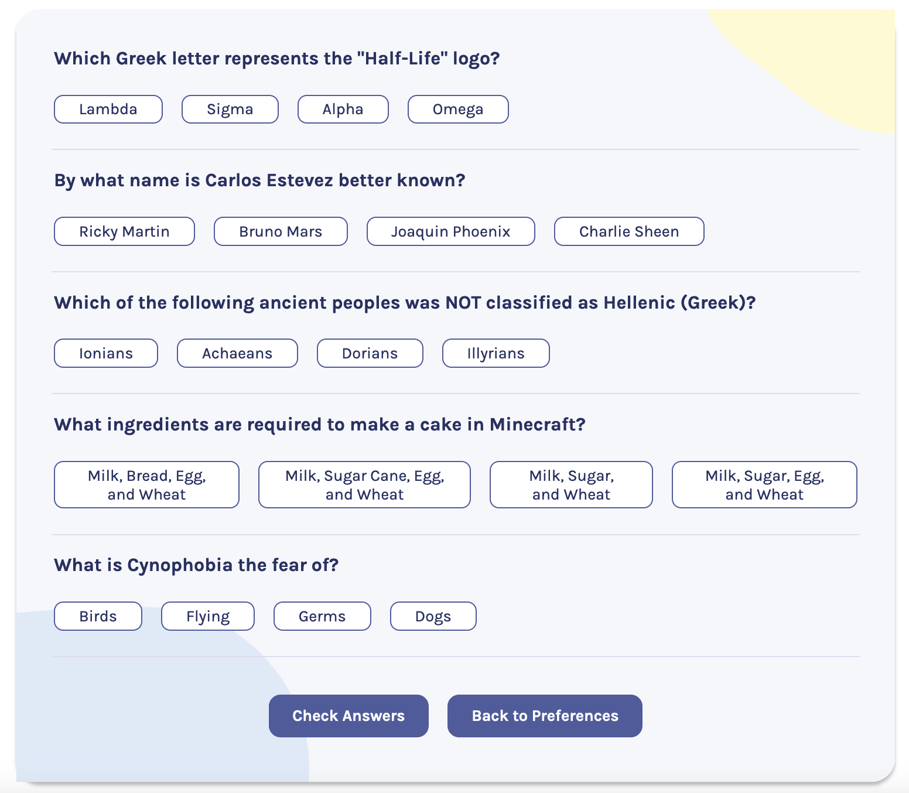

# Quizzical App ❔✅

#### ✨ Deployed/demo version 

## Demo overview
Quizzical is a trivia game built in React.js using the 'Open Trivia DB'. 

Possible actions:
- The inital page allows the user to choose the category and difficulty
- On the questions page, 5 questions are displayed with respective answer options
- The user chooses (clicks to hold) the answers for all questions
- The game checks for the user score and displays the correct and incorrect answers
- The user can choose to play again or change the preferences on the homepage

## Developer overview
This is the first time I built a React app from scratch by myself and it was a challenging and rewarding exercise.
- All the 'state' pieces are held and managed on the main App file and passed downed to the components making use of 'props'
- In the initial page the user selects the category and difficulty level for the questions. The value from those input fields informs how the API call should happen
- Upon receiving the data, the incorrect and correct answers are joined in one array and shuffled to be in a random order
- The relevant data is used to create the elements to be displayed on the screen
- Using conditional rendering, the answers that are chosen by the user and clicked are displayed with a different colour. The selected answers are held in an array updated using state
- Once an answer to each question is chosen, the app checks the selected answers array to see which ones match the correct answer property
- The app displays the correct answers in green and wrong answers in red using conditional rendering and it displays the score
- By choosing to play again a new API call is made with the same settings and a new set of 5 questions is displayed
- By choosing to go back to preferences the user can choose a different category and level and start the game from scratch

 

 

 

## API
- 

## Author: 
👩‍💻 Rebecca Louw 

## Built with:

  
 
 
 
