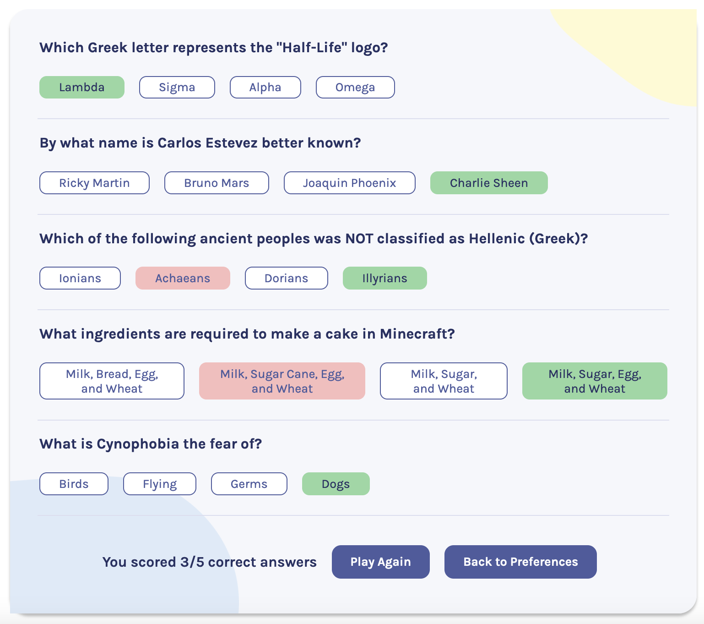

# Quizzical ❔✅ 

#### ✨ Deployed/demo version 

## Demo overview
Quizzical is a trivia game built in React.js using the 'Open Trivia DB'. 

Possible actions:
- The inital page allows the user to select the subject category and difficulty level
- On the questions page, 5 questions are displayed with their associated answer options
- The user selects (clicks to hold) the answers for all questions
- The game checks for the user score and displays the correct and incorrect answers
- The user can choose to play again or change the preferences on the homepage

## Developer overview
This is the first time I built a React app from scratch by myself and although it was challenging, it was a very rewarding exercise.
- The app using function components and React Hooks
- All the 'State' pieces are held and managed on the main App file and passed down to the components, making use of 'props'
- On the initial page the user selects the subject category and difficulty level for the questions. The value from those input fields syncs with 'State' and informs how the API call should happen
- Upon receiving the data, the incorrect and correct answers are joined together into one array and shuffled to display in a random order
- The relevant data is used to create the JSX elements to be displayed on the screen
- Using conditional rendering, the answers that are selected by the user are displayed with a different colour. The selected answers are held in an array synced with 'State'
- Once an answer to each question is selected, the app checks the selected answers array to see which ones match the correct answer property
- Using conditional rendering, the app displays the correct answers in green and wrong answers in red, along with the user score
- At the end of the quiz, if the user selects the 'Play Again' button, a new API call is made with the same settings, however, with a new set of 5 questions being displayed. Alternatively, if the user selects the 'Back to Preferences' button, the user can choose a different subject category and difficulty level, and restart the game

 

 

 

## API
- 

## Author: 
👩‍💻 Rebecca Louw 

## Built with:

  
 
 
 
